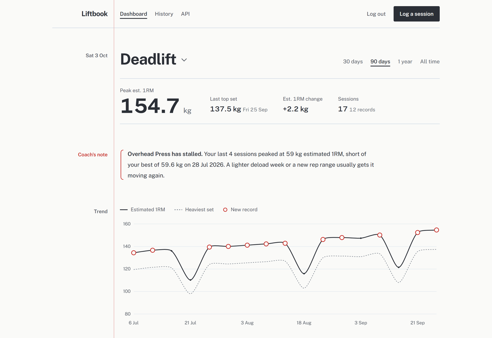
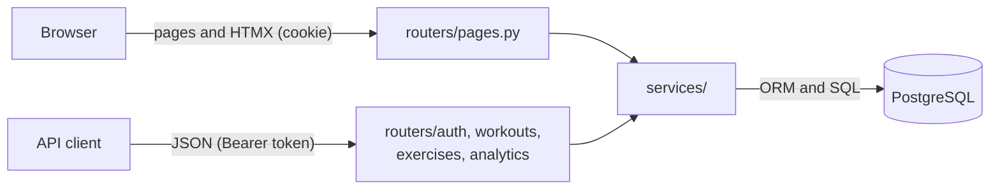

# Liftbook

[](https://github.com/Shreesha2004/liftbook/actions/workflows/ci.yml)

A workout log for barbell training. You log your sets and it works out an estimated one-rep max
for every session, marks personal records, charts weekly volume per muscle group, shows a
training calendar and points out lifts that have stopped improving.

The analytics run as SQL in PostgreSQL. The app is built with FastAPI and serves both
server-rendered pages (Jinja2 and HTMX) and a JSON API.



## Features

- Estimated 1RM for each session (Brzycki formula), with the change from the previous session
  and personal records marked on the chart
- Plateau alerts for lifts trained in the last 30 days whose last four sessions didn't beat the
  earlier best
- A personal records table with the best set for each exercise
- Weekly volume by muscle group and a 26-week training calendar that includes rest days
- A logging form that works on a phone: steppers for reps and weight, "Add a set" copies the
  previous row, and custom exercises can be added without leaving the form
- Accounts with JWT authentication and Argon2 password hashing. Every query is scoped to the
  logged-in user.
- A REST API with OpenAPI docs at `/docs`

## Stack

| Part | Tools |
|---|---|
| Web framework | FastAPI, Uvicorn, Pydantic v2, pydantic-settings |
| Database | PostgreSQL 17, SQLAlchemy 2.0, psycopg2, Alembic |
| Auth | OAuth2 password flow, PyJWT, pwdlib (Argon2), httpOnly cookie for the pages |
| Frontend | Jinja2, HTMX, Tailwind CSS, Chart.js, Public Sans |
| Tests and linting | pytest, pytest-cov, httpx, Ruff |
| Deployment | Docker, Docker Compose, GitHub Actions, Render |

## How it fits together



Routers only deal with HTTP. Ownership checks, record detection and the analytics queries live
in `app/services`, so the pages, the HTMX fragments and the JSON API all use the same code.
Services raise domain errors (`NotFoundError`, `ConflictError`), and `app/main.py` turns them
into a JSON error, an HTMX fragment or an error page depending on the request.

There are four tables: `users`, `exercises`, `workouts` and `workout_sets`. Exercises without
an owner make up the shared catalog, and users can add their own. Partial unique indexes keep
exercise names unique (ignoring case) in the catalog and in each user's list, and check
constraints keep reps between 1 and 36 and weight at zero or above.

## The analytics queries

Progression groups each session in a CTE, then compares it with earlier sessions using window
functions:

```sql
WITH session_metrics AS (
    SELECT w.id AS workout_id, w.performed_at AS session_date,
           MAX(s.weight * 36.0 / (37 - s.reps)) AS max_1rm          -- Brzycki
    FROM workout_sets s JOIN workouts w ON w.id = s.workout_id
    WHERE w.user_id = :user_id AND s.exercise_id = :exercise_id
    GROUP BY w.id, w.performed_at
),
windowed AS (
    SELECT *,
           LAG(max_1rm) OVER sessions AS prev_1rm,
           MAX(max_1rm) OVER (sessions ROWS BETWEEN UNBOUNDED PRECEDING AND 1 PRECEDING)
               AS prev_best_1rm
    FROM session_metrics
    WINDOW sessions AS (ORDER BY session_date, workout_id)
)
SELECT *, max_1rm - prev_1rm AS delta_1rm,
       COALESCE(max_1rm > prev_best_1rm, FALSE) AS is_pr
FROM windowed
WHERE :since IS NULL OR session_date >= :since;
```

The date filter comes after the window functions, so the first session in a 30-day view is
still compared with the one before it. The other queries in
[app/services/analytics.py](app/services/analytics.py) use `ROW_NUMBER()` for personal records,
`MAX(...) FILTER (WHERE ...)` for plateaus and `generate_series` for the calendar. The Brzycki
formula is defined once in Python and once in SQL in `app/one_rep_max.py`, and a test checks
that both give the same result.

## Running it

With Docker:

```bash
docker compose up --build
```

Open http://localhost:8000 and click "Open the demo account". On the first start the container
runs the migrations and creates six months of training history for `demo@example.com` /
`demo1234`.

Without Docker you need Python 3.12+ and PostgreSQL:

```bash
python -m venv venv
venv\Scripts\activate             # macOS/Linux: source venv/bin/activate
pip install -e ".[dev]"
copy .env.example .env            # macOS/Linux: cp. Then set DATABASE_URL and SECRET_KEY
python -m app.prestart            # run migrations
python -m app.seed                # optional: demo data
uvicorn app.main:app --reload
```

## API

The docs at `/docs` let you log in with **Authorize** and try each endpoint.

| Method | Path | Description |
|---|---|---|
| POST | `/api/auth/register` | Create an account |
| POST | `/api/auth/token` | Log in and get a JWT |
| GET | `/api/auth/me` | Current user |
| GET, POST | `/api/exercises` | List the catalog and your exercises, or add one |
| GET, POST | `/api/workouts` | List workouts (paginated), or log one |
| GET, PUT, DELETE | `/api/workouts/{id}` | Read, replace or delete a workout |
| GET | `/api/workouts/{id}/summary` | Totals per exercise for one workout |
| GET | `/api/analytics/progression/{exercise_id}` | Estimated 1RM per session |
| GET | `/api/analytics/personal-records` | Best set per exercise |
| GET | `/api/analytics/weekly-volume` | Volume per muscle group per week |
| GET | `/api/analytics/frequency` | Sessions per day |
| GET | `/api/analytics/plateaus` | Lifts that have stalled |

## Tests

```bash
pytest --cov
```

The tests use a real PostgreSQL database instead of SQLite, because the analytics depend on
Postgres features. Each run creates a fresh `<db>_test` database with the same migrations as
production, and every test runs inside a transaction that is rolled back afterwards. The 72
tests cover auth, ownership between users, validation, each analytics query against values
worked out by hand, and the pages and HTMX fragments.

GitHub Actions runs three jobs on every push: Ruff, the test suite with a 90% coverage minimum
(after checking that the migrations match the models and can be rolled back and re-applied),
and a Docker build that starts the Compose stack and checks that the app responds.

## Migrations

`0001_baseline` is the original single-user schema. `0002_users_and_exercise_catalog` adds
accounts and the exercise catalog and keeps existing data: old workouts go to the demo account
and free-text exercise names are matched to the catalog. `python -m app.prestart` recognises a
database created before Alembic was added, stamps it at `0001` and upgrades it.

## Deploying

`render.yaml` deploys the Docker image to Render. Create a Postgres database (Neon's free tier
works), then create a Blueprint from this repo in Render and paste the connection string as
`DATABASE_URL`. Render generates `SECRET_KEY`, and the demo account is seeded on first start.

## Project layout

```
app/
  routers/        HTTP routes: the JSON API and the HTML pages
  services/       business logic and the analytics queries
  templates/      Jinja2 pages and HTMX partials
  models.py       SQLAlchemy models
  schemas.py      request and response models
  security.py     password hashing and JWTs
  one_rep_max.py  Brzycki formula in Python and SQL
  seed.py         demo data
  prestart.py     runs migrations (and the seed) before the server starts
alembic/          migrations
tests/            one test file per feature
```

## License

MIT
